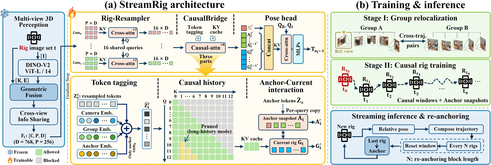

# StreamRig：利用相机组内几何的流式多相机里程计

<p align="center">
  <a href="https://weiyufei0217.github.io/StreamRig/"></a>
  <a href="https://arxiv.org/abs/2609.40244"></a>
</p>

[English](README.md)

StreamRig 是一种因果多相机视觉里程计方法：冻结的 MapAnything 前端结合标定逐时刻感知整个相机组（rig），
Rig-Resampler 将每台相机压缩为少量潜在 token，CausalBridge 在压缩后的历史上做因果注意力，
位姿头输出各相机组相对周期性重设锚点的公制位姿。

<p align="center"></p>

## 安装

```bash
conda create -n streamrig python=3.12 -y
conda activate streamrig
pip install torch==2.9.1 torchvision==0.24.1 torchaudio==2.9.1 --index-url https://download.pytorch.org/whl/cu128
pip install -r requirements.txt
pip install -e ./third_party/mapanything
pip install -e .
```

MapAnything 主干权重（DINOv2-large）的下载方式见 [G2G 安装说明](https://github.com/WeiYuFei0217/G2G#2-install-mapanything-backbone)。

## 数据

每个数据集需生成相机组元数据和冻结前端的特征缓存：

- [NCLT](data_preprocessing/nclt/README_CN.md)（五目，特征缓存约 470 GiB）
- [KITTI-360](data_preprocessing/kitti360/README_CN.md)（四目，特征缓存约 104 GiB）

## 权重

从 [Hugging Face](https://huggingface.co/feixue22/StreamRig) 或[百度网盘](https://pan.baidu.com/s/1sPUkvda6HD85fm3q_KPkAw?pwd=8888)（提取码 `8888`）
下载到 `release_weights/`，并用 `cd release_weights && sha256sum -c SHA256SUMS` 校验。

| 文件 | 数据集 |
|---|---|
| `NCLT-StreamRig.pth` | NCLT |
| `KITTI360-StreamRig.pth` | KITTI-360 |

## 训练

填写 [配置文件](configs/) 中的 `/path/to/...`。`model.warmstart_ckpt` 为用
[G2G](https://github.com/WeiYuFei0217/G2G#relocalization-task-1) 训练的重定位模型。

```bash
bash scripts/train.sh 0,1,2,3 configs/nclt_streamrig.yaml outputs/nclt_streamrig 29601
bash scripts/train.sh 0,1,2,3 configs/kitti360_streamrig.yaml outputs/kitti360_streamrig 29611
```

## 评测

```bash
bash scripts/eval_nclt.sh \
  --step1-root /data/nclt_meta/step1_rig_trajectories_test \
  --step2-root /data/nclt_meta/step2_rig5_configs_test \
  --infoshare-root /data/nclt_infoshare_test \
  --out-dir outputs/eval_nclt

bash scripts/eval_kitti360.sh \
  --processed-root /data/kitti360/streamrig_metadata \
  --infoshare-root /data/kitti360/infoshare_bf16 \
  --out-dir outputs/eval_kitti360
```

两个脚本默认使用发布权重；评测自训模型时加 `--ckpt <final.pt 或导出的 .pth>`。

| 数据集 | 序列 | t_rel (%) | r_rel (°/100 m) | ATE (m) |
|---|---|---|---|---|
| NCLT | 2012-02-19、2012-08-20 | 2.77 | 1.39 | 28.4 |
| KITTI-360 | 0009、0010 | 2.59 | 0.98 | 63.7 |

指标采用 KITTI 里程计协议（100–800 m 子段，stride 3），ATE 在完整序列上做 SE(3) 对齐；
录制中断处前后两段以真值相对位姿衔接后再计算指标。NCLT 评测约需 35 GB 内存。

## 引用

如果本工作对你有帮助，请引用：

```bibtex
@misc{wei2026streamrigexploitingintrariggeometry,
      title={StreamRig: Exploiting Intra-Rig Geometry for Streaming Multi-Camera Odometry},
      author={Yufei Wei and Shuhao Ye and Qi Wang and Xin Zheng and Qing Huang and Rong Xiong and Yue Wang},
      year={2026},
      eprint={2609.40244},
      archivePrefix={arXiv},
      primaryClass={cs.CV},
      url={https://arxiv.org/abs/2609.40244},
}
```

## 致谢与许可

StreamRig 基于 [MapAnything](https://github.com/facebookresearch/map-anything)、
[DINOv2](https://github.com/facebookresearch/dinov2) 和 G2G。代码以 [CC BY-NC 4.0](LICENSE) 发布；
附带的 MapAnything 代码保留其 [Apache 2.0 许可](third_party/mapanything/LICENSE)。
